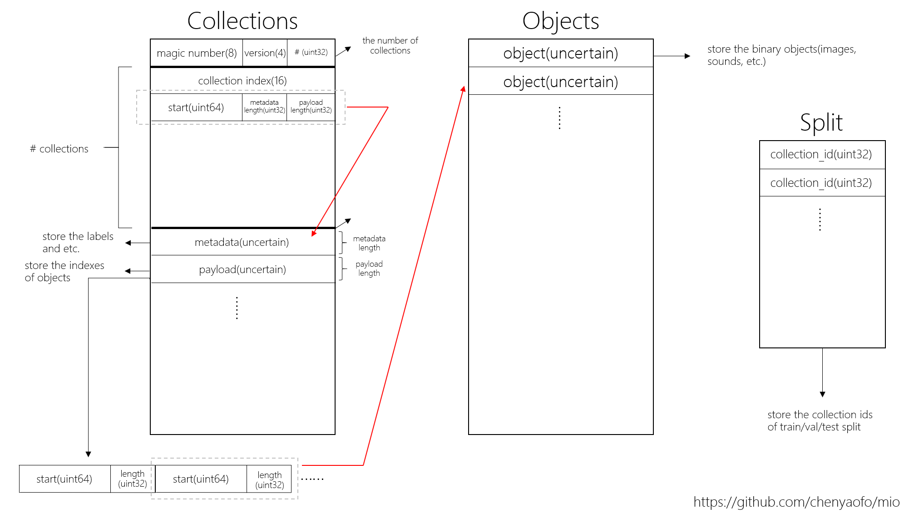

# MIO

MIO is a efficient database engine for deep learning research.

# Install

```
pip install -e git://github.com/chenyaofo/mio.git@v0.1.0
```

## Motivation

In deep learning, the data is too large to store, read and migrate. There are some database engine can deal with that, such as leveldb and lmdb. But they have some drawbacks. For instance, leveldb is optimized for random writing as well as the dataset size of lmdb format is larger serveral times than mormal one. And they have some other considerations(like transaction) without reference to deep learning.

The requirements of deep learning data format is very simple. In deep learning, a sample consists of two part, data and label. The most common way to use the data is selecting some samples randomly from the whole dataset every iteration in one epoch. Therefore, the data store format must support to fetch anyone sample in O(1) time.

## Concepts

There are two core concepts in mio format. The first one is **collection**, the another is **object**.

Collection corresponds to the sample in deep learning. Collection includes two parts, **metadata** and **payload**. Metadata is designed to store the labels, such as category, bouding box anotation. Paylooad store the indexes to objects.

In some task, like video analysis, a sample(video) is consists of many frames. So we have the concept of **object**. A collection can include lots of objects.

## Example

### Write to mio dataset
For example, we have a video dataset. Firstly, we extract all the frames from the videos.

The directory is list this,

```
video_dataset/
├── first_category
│   ├── first_video
│   │   ├── 1.jpg
│   │   ├── 2.jpg
│   │   └── ...
│   ├── second_video
│   │   ├── 1.jpg
│   │   ├── 2.jpg
│   │   └── ...
│   └── ...
├── second_category
│   ├── first_video
│   │   ├── 1.jpg
│   │   ├── 2.jpg
│   │   └── ...
│   ├── second_video
│   │   ├── 1.jpg
│   │   ├── 2.jpg
│   │   └── ...
│   └── ...
└── ...
```

Here, we can use following code to create a mio dataset,

``` python
import struct
import pathlib
from mio import MioWriter


root = pathlib.Path("path/to/video_dataset")

with MioWriter("path/to/store") as m:
    for i,category in enumerate(root.iterdir()):
        for video in category.iterdir():
            with m.create_collection() as c:
                c.set_meta(struct.pack("<I", i))
                for frame in video.iterdir(): # pay attention to the order of the frames
                    c.add_object(frame.read_bytes())
```

### Read from mio dataset

Here is some simple documents about how to use the api to fetch items.

``` python
from mio import MIO


m = MIO("path/to/store")

# return the number of collections
m.size => int 

# return the number of objects of specific collection
m.get_collection_size(collection_id:int) => int 

# return the metadata of specific collection
m.get_collection_metadata(collection_id:int) => bytes 

# fetch one object from dataset, the object_id has default vvalue 0
m.fetchone(collection_id:int, object_id:int) => bytes

# fetch some objects from dataset, the object_ids shoule be a list of int
m.fetchmany(colletion_id:int, object_ids:list[int]) => list[bytes]

# fetcj all the objects from dataset
m.fetchall(colletion_id:int) => list[bytes]
```

## Binary Format




